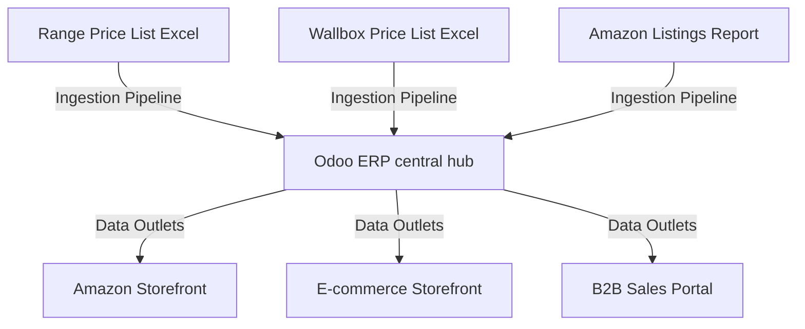

# Odoo E-commerce Data Integration & Pipelines

This repository houses the integration scripts, data pipelines, and customization rules for our e-commerce business operations.

## Business Vision & Architecture

Our goal is to build a robust, scalable e-commerce infrastructure using **Odoo ERP** as our central database and **source of truth**. All product data, inventories, customer records, and order operations flow through Odoo. From this central hub, data pipelines synchronize product listings, prices, and stock levels to various sales channels and outlets (e.g., Shopify, Amazon, WooCommerce, eBay).



---

## Current Pipelines

### Excel-to-Odoo Product Ingestion (`import_products.py`)
A robust Python command-line utility designed to read diverse spreadsheet structures (regular sheets, macro-enabled `.xlsm` sheets, Amazon listings reports) and upsert them safely into the Odoo catalog.

#### Key Features:
*   **Dynamic Column Mapping**: Resolves data headers using a synonyms dictionary (mapping columns like `Article` or `Item NO` automatically to `SKU`).
*   **Data Protection Safeguards**: Missing Excel columns or filtered out keys (such as ASINs) are ignored instead of written as `False` or `0.0`. This protects pre-existing values in Odoo.
*   **Automatic Category Resolution**: Resolves or creates a product category named **"Goods"** and maps imported items to it.
*   **Dry Run Support**: Run imports with `--dry-run` to preview creations and field changes before committing edits to Odoo.

---

## How to Get Started

### 1. Environment Setup
Install dependencies into a virtual environment:
```bash
python3 -m venv venv
source venv/bin/activate
pip install -r requirements.txt
```

### 2. Connection Settings
Configure connection properties in a `.env` file (see `.env.template` for reference):
```env
ODOO_URL=https://your-domain.odoo.com
ODOO_DB=your-database-name
ODOO_USERNAME=your-email@domain.com
ODOO_PASSWORD=your-api-key
```

### 3. Run Ingestions
Perform a dry run to check what changes will be applied:
```bash
./venv/bin/python import_products.py --file [path_to_excel] --dry-run
```

Apply the changes to Odoo:
```bash
./venv/bin/python import_products.py --file [path_to_excel]
```
